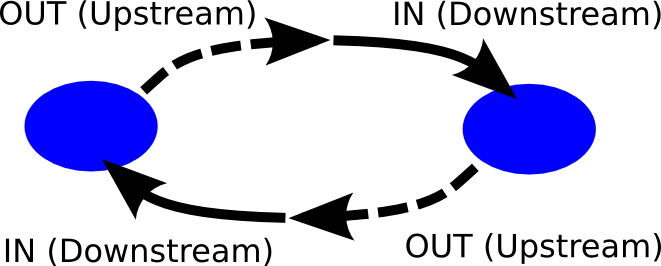

# DB - docssss

## Struktura

### ASNode

Ważnym założeniem jest, że baza jest spójna na poziomie połączeń out/in. To znaczy jeśli z jednego ASNode'a jest połączenie out do drugiego, to w nim musi być in i na odwrót.
Dzięki temu wyszukiwanie w tym grafie będzie zwracało identyczne wyniki niezależnie od punktu początkowego traversowania.
Informacje na temat anomalii związanych z połączeniami (jest out, nie ma odpowiadającego in; jest in nie ma out) przechowywane są w klasie ASConn.
Dzięki temu podziałowi, trawersowanie grafu jest proste (same ASNode'y), a dodatkowo można pobrać informacje o anomaliach.

* @rid
* num
* name
* pools - linkset ASPool
* out - linkset ASNode - lista ASNode'ów do których jest połączenie typu upstream
* in - linkset ASNode - lista ASNode'ów do których jest połączenie typu downstream

### ASConn

* @rid
* from - link ASNode
* to - link ASNode
* status - short
    * 0 - połączenie poprawne
	* 1 - brak skonfigurowanego połączenia po stronie 'from'
	* 2 - brak skonfigurowanego połączenia po stronie 'to'

### ASPool

Wiadomka
